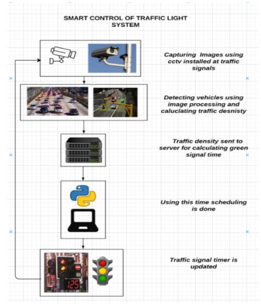

# <center>Traffic Intersection Simulation</center>

*"This is a simulation from scratch using Pygame to simulate the movement of vehicles across a traffic intersection having traffic lights with a timer. It contains a 4-way traffic intersection with traffic signals controlling the flow of traffic in each direction. Each signal has a timer on top of it which shows the time remaining for the signal to switch from green to yellow, yellow to red, or red to green. Vehicles such as cars, bikes, buses, and trucks are generated, and their movement is controlled according to the signals and the vehicles around them. This simulation can be further used for data analysis or to visualize AI or ML applications."*

It is authored by [Mihir M. Gandhi](https://github.com/mihir-m-gandhi), Devansh S. Solanki, Rutwij S. Daptardar, and Nirmala Shinde Baloorkar. The paper "[Smart Control of Traffic Light Using Artificial Intelligence](https://ieeexplore.ieee.org/document/9358334)" published in 5th IEEE International Conference on Recent Advances and Innovations in Engineering 

The proposed system aims to utilize live images from the cameras at traffic junctions for traffic density calculation using image processing and AI. 

The proposed system aims to design a traffic light controller based on Computer Vision that can adapt to the current traffic situation. It uses live images from the CCTV cameras at traffic junctions for real-time traffic density calculation by detecting the number of vehicles at the signal and setting the green signal time accordingly. The vehicles are classified as a car, bike, bus/truck, or rickshaw to obtain an accurate estimate of the green signal time. It uses YOLO in order to detect the number of vehicles and then set the timer of the traffic signal according to vehicle density in the corresponding direction.

### <center>Algorithm:</center>

<p align="center">
    
</p>

------

### Demo

The video below shows the final output of the simulation.

<p align="center">
    
</p>


------------------------------------------

### Prerequisites

[Python 3.1+](https://www.python.org/downloads/)

------------------------------------------

### Installation

 * Step I: Clone the Repository

```sh
      $ git clone https://github.com/runhaozhou/Traffic_Intersection_Simulation.git
```

  * Step II: Install the required packages

```sh
      # On the terminal, move into Traffic-Intersection-Simulation-with-Turns directory
      $ cd Traffic-Intersection-Simulation-with-Turns
      $ pip install pygame
```

* Step III: Run the code

```sh
      # To run simulation
      $ python simulation.py
```

------------------------------------------

### License

This project is licensed under the MIT - see the [LICENSE](./LICENSE) file for details.